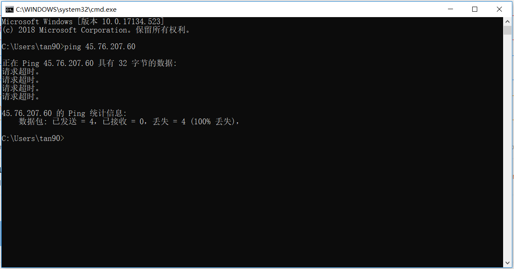

# 如何使用vultr科学上网

打开vultr的网页，注册账号，~~充钱变强~~

选择服务器节点和配置信息


发现ping不通



不是我自己网络问题，明显是被墙了~~(大清国网墙万岁)~~


一气之下开了四个


然后有一个可用的

打开putty，连接服务器，输入以下代码

```
wget —no-check-certificate -O shadowsocks-all.sh https://raw.githubusercontent.com/teddysun/shadowsocks_install/master/shadowsocks-all.sh
chmod +x shadowsocks-all.sh
./shadowsocks-all.sh 2>&1 | tee shadowsocks-all.log
```

配置服务器，得到端口和一串ssr链接

配置防火墙


将刚才的ssr码导入shadowsocks，使用shadowsocks连接服务器


成功

